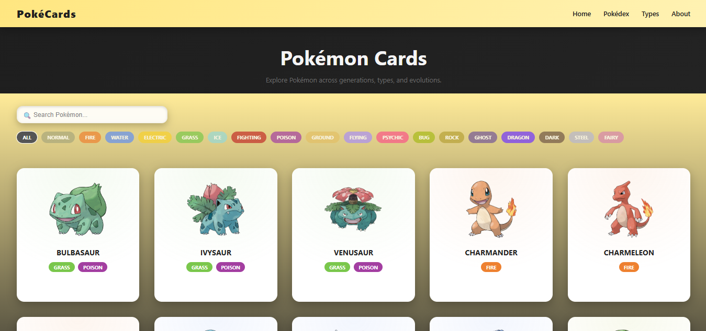
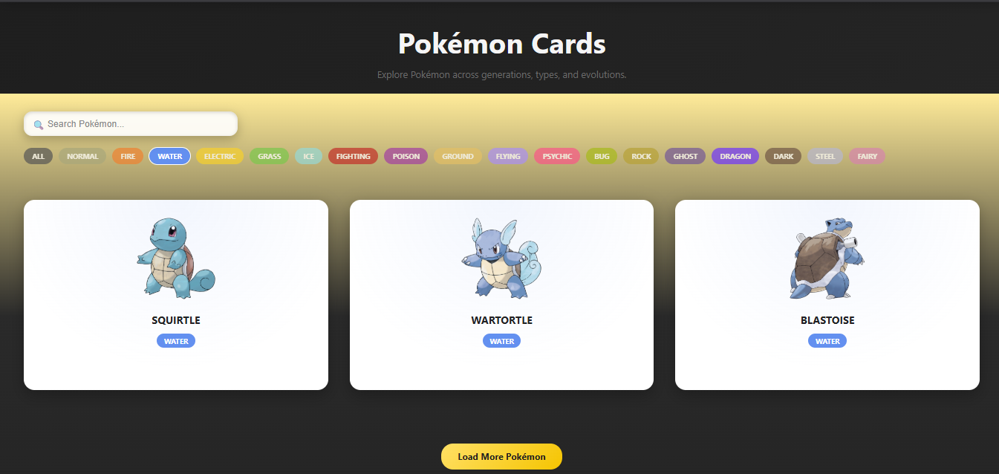
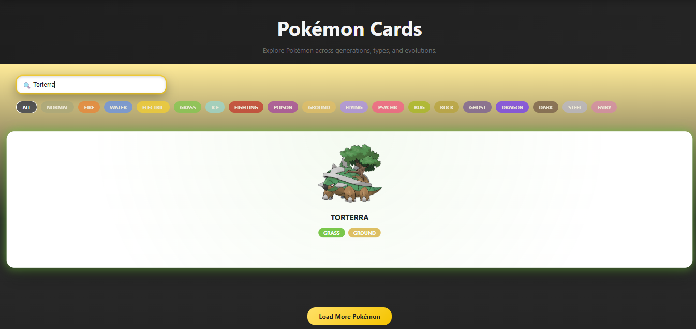
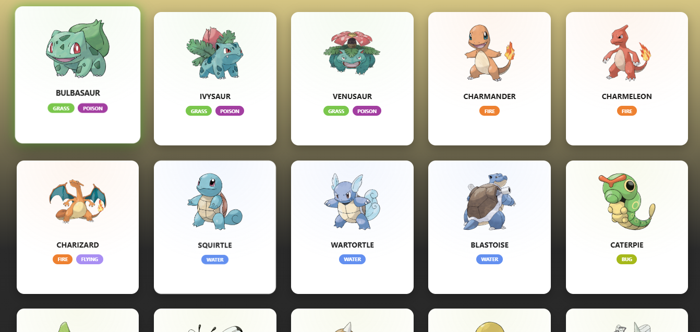

# 🟡 PokéCards | Modern Pokédex

PokéCards is a modern, interactive Pokédex-style web application that allows users to explore Pokémon with a clean interface, smooth animations, and Pokémon-inspired theming.

Built to feel like a real product, PokéCards focuses on usability, performance, and visual polish.

---

## ✨ Features

- 🔍 Search Pokémon by name
- 🎨 Filter Pokémon by all 18 Pokémon types
- 🃏 Interactive Pokémon cards with hover glow
- 📜 Load more Pokémon (pagination)
- 🌗 Premium dark + Pokémon yellow theme
- 📱 Responsive and modern UI
- ⚡ Fast performance using Vite + React

---

## 📸 Screenshots

### 🏠 Home


### 🎨 Type Filters


### 🔍 Search


### 🃏 Pokémon Cards


---

## 🛠️ Tech Stack

- **Frontend:** React (Vite)
- **Styling:** Custom CSS (no UI libraries)
- **Data Source:** PokéAPI
- **Build Tool:** Vite

---

## 🚀 Getting Started

### 1️⃣ Clone the repository
```bash
git clone https://github.com/<your-username>/pokecards.git
cd pokecards
````

### 2️⃣ Install dependencies

```bash
npm install
```

### 3️⃣ Run locally

```bash
npm run dev
```

Open `http://localhost:5173` in your browser.

---

## 🌐 Live Demo

👉 **Live Site:** *Coming soon*

(Will be updated after deployment)

---

## 📜 Credits

* Pokémon data provided by **PokéAPI**
* Pokémon names, images, and related content are © Nintendo, Creatures Inc., and GAME FREAK Inc.
* Designed & developed by **Vaibhav Bodade**
* UI architecture and development assistance by **ChatGPT**

---

## ⚠️ Disclaimer

This is an unofficial, non-commercial fan project created for educational and demonstrational purposes only.

---

## ⭐ Support

If you like this project, consider giving it a ⭐ on GitHub!
